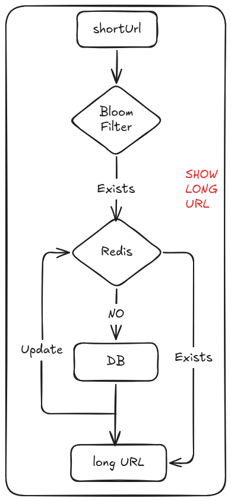

:PROPERTIES:
#+title: 短链接项目
#+author: singdile
#+date: 2026-07-02

* 环境搭建

使用docker启动mysql,构建两个表。
- 一个是发号器表,用于生成唯一ID.
- 一个是长短链接映射表，用于记录长短链接的一一对应关系

*创建发号器表*
#+begin_src sql
    CREATE TABLE `sequence` (
  `id` bigint(20) unsigned NOT NULL AUTO_INCREMENT,
  `stub` varchar(1) NOT NULL,
  `timestamp` timestamp NOT NULL DEFAULT CURRENT_TIMESTAMP ON UPDATE CURRENT_TIMESTAMP,
  PRIMARY KEY (`id`),
  UNIQUE KEY `idx_uniq_stub` (`stub`)
  ) ENGINE=MyISAM DEFAULT CHARSET=utf8 COMMENT = 'sequence table';
#+end_src
#+begin_src sql 
-- 创建长短链接map表
CREATE TABLE `short_url_map` (
 `id` bigint unsigned not null AUTO_INCREMENT COMMENT '主键',
 `create_at` DATETIME not null DEFAULT CURRENT_TIMESTAMP COMMENT '创建时间',
 `create_by` varchar(64) not null DEFAULT '' COMMENT '创建者',
 `is_del` tinyint UNSIGNED not null DEFAULT '0' COMMENT '是否删除:0正常1删除',

 `lurl` varchar(2048) DEFAULT NULL COMMENT '长链接',
 `surl` varchar(11) DEFAULT NULL COMMENT '短链接',
 `lurl_hash` bigint DEFAULT NULL COMMENT '长链接的 MurmurHash3 值，用于高效索引',
 PRIMARY KEY (`id`),
 KEY `idx_lurl_hash` (`lurl_hash`),
 INDEX `idx_is_del` (`is_del`),
 UNIQUE KEY `uk_surl`(`surl`)
) ENGINE=InnoDB DEFAULT CHARSET=utf8 COMMENT = 'url_map';
#+end_src

为什么使用 MurmurHash3 值而不使用 md5 值作为长链接的索引?
- MurmurHash3 是非加密型的散列函数，计算速度快
- MurmurHash3 输出的是64位无符号的整数，而MD5存储到Mysql上是32字节的字符串
- 使用数字做索引，内部的排序、移动等操作需要的损耗更小

* 快速启动

#+begin_src bash
docker compose up -d
go run shortlink.go
#+end_src

访问 http://localhost:8888/v1/shorturl

* 搭建go-zero框架的骨架

** 编写api文件 shortlink.api
  两个接口:
  - 一个由长链接创建短链接 POST
  - 一个由短链接获取长链接 GET
    #+begin_src api
  @server (
	  prefix: /v1
  )

  service shortlink-api {
	  @handler ConvertHandler
	  post /shorturl (ConvertRequest) returns (ConvertResponse)

	  @handler ShowHandler
	  get /:shortUrl (ShowRequest) returns (ShowResponse)
  }
    #+end_src
生成对应的go文件：
=goctl api go -api shortlink.api -dir .=

** 生成数据库中的表对应的model代码

model层代码，用于对数据库中的数据进行CRUD.
#+begin_src 
goctl model mysql datasource -url "root:123456@tcp(127.0.0.1:13306)/url" -table="sequence" -dir "./model"

goctl model mysql datasource -url "root:123456@tcp(127.0.0.1:13306)/url" -table="short_url_map" -dir "./model"
 #+end_src
下载相关依赖 :: =go mod tidy=

** 运行

=go run shortlink.go= 
** 修改配置结构体和配置文件
etc/shortlink-api.yaml 与 internal/config/config.go 文件对齐

* 参数校验
1. 使用 *validator* 进行链接格式验证
   =go get github.com/go-playground/validator/v10=
   参考使用示例: [[https://raw.githubusercontent.com/go-playground/validator/master/_examples/simple/main.go][validator的simple使用]]
   api文件中为结构体添加 tag,
   #+begin_src api
type ConvertRequest {
	LongUrl string `json:"longUrl" validate:"required,http_url"`
}
   #+end_src
2.验证长链接是否是有效的
发送http请求，判断返回的响应状态码是否是200

* API 文档

** POST /v1/shorturl — 创建短链接

#+begin_src bash
curl -X POST http://localhost:8888/v1/shorturl \
  -H "Content-Type: application/json" \
  -d '{"longUrl":"https://example.com"}'
#+end_src

#+begin_src json
{"shortUrl":"singdile.space/aB3xZ"}
#+end_src

** GET /v1/:shortUrl — 访问短链接

浏览器访问 =http://localhost:8888/v1/singdile.space/aB3xZ= 返回 HTTP 307 重定向到原长链接。

* 核心设计

| 特性 | 说明 |
|------|------|
| 发号器 | MyISAM + REPLACE INTO 生成唯一递增 ID |
| Base62 编码 | 数字 ID → 短码 (0-9A-Za-z)，比 Base64 更友好 |
| Murmur3 哈希 | 长链接去重，速度快、输出仅 8 字节整数 |
| Bloom Filter | 快速判断短码一定不存在，减少 Redis/DB 压力 |
| 黑名单 | ~128 个保留词和敏感词，拒绝生成对应短码 |
| URL 可达性检查 | 创建前发送 HEAD 请求验证链接有效性 |
| 循环链接检测 | 禁止将已有短链接再次缩短 |
| Redis 缓存 | short→long 缓存 120s TTL |
| SingleFlight | 同一时间只有一个请求回查 DB，防止缓存击穿 |

* 配置说明

| 字段 | 说明 |
|------|------|
| Host / Port | 服务监听地址 |
| ShortUrlDB | 长短链接映射表 MySQL DSN |
| SequenceDB | 发号器表 MySQL DSN |
| RedisConf | 缓存 Redis (短链→长链) |
| BizRedis | 业务 Redis (Bloom Filter) |
| BloomFilter | 布隆过滤器 Key 名称和位长度 |
| Domain | 短链接域名前缀 |
| BlackList | 禁止生成的短码列表 |

* 测试

#+begin_src bash
go test ./...
#+end_src

* 迁移文件

=migrations/= 目录存放数据库版本迁移 SQL，通过 docker 中的 =migrate/migrate= 容器自动执行。
* 实现模块架构图
[[./convertURL.png][长链接转换短链接
]]
